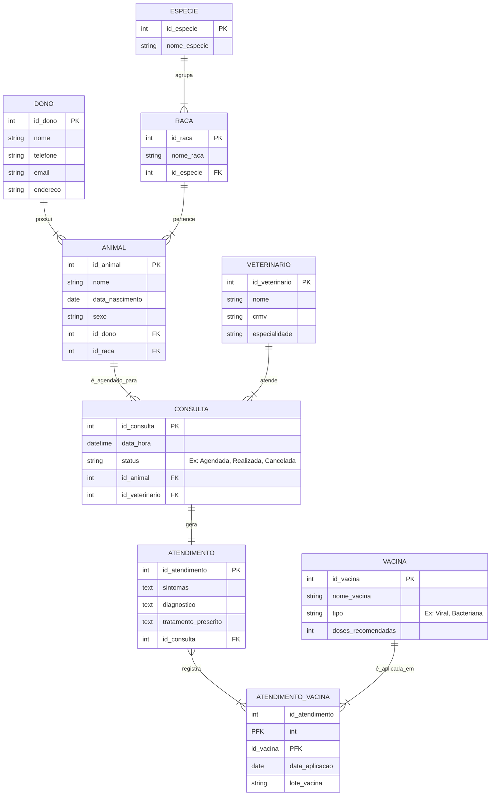

# Projeto de Banco de Dados: Clínica Veterinária "PetFeliz"

Este repositório contém os artefatos do projeto de modelagem e implementação de um banco de dados para uma clínica veterinária fictícia, como parte das atividades da disciplina de Modelagem de Banco de Dados.

O projeto abrange desde a concepção do minimundo, passando pelo modelo conceitual (DER), modelo lógico (normalização) e, finalmente, a implementação física com scripts SQL (DDL e DML).

-----

## 1\. Descrição do Minimundo

O "PetFeliz" é um sistema focado no gerenciamento de uma pequena clínica veterinária. O público-alvo são os recepcionistas e os médicos veterinários. O propósito principal é centralizar a agenda de consultas e o histórico médico dos animais (pacientes).

-----

## 2\. Modelo Lógico (DER)

O diagrama abaixo representa a estrutura lógica final do banco de dados, já normalizada (3FN).



-----

## 3\. Tecnologias Utilizadas

  * **Modelagem:** Diagrama Entidade-Relacionamento (DER), Normalização (1FN, 2FN, 3FN).
  * **Banco de Dados:** SQL (Scripts compatíveis com MySQL / MariaDB).
  * **Ferramentas:** MySQL Workbench (ou DBeaver / PGAdmin) e Git/GitHub para versionamento.

-----

## 4\. Instruções de Execução

Para recriar este banco de dados em seu ambiente local (ex: MySQL Workbench):

1.  **Crie o Banco de Dados:**
    ```sql
    CREATE DATABASE petfeliz_db CHARACTER SET utf8mb4 COLLATE utf8mb4_unicode_ci;
    USE petfeliz_db;
    ```
2.  **Crie as Tabelas:**
    Execute o conteúdo do arquivo `SCHEMA.sql` para criar toda a estrutura de tabelas e relacionamentos.
3.  **Popule o Banco de Dados:**
    Execute o conteúdo do arquivo `INSERTS.sql` para adicionar os dados de exemplo. A ordem de execução deste script é importante.
4.  **Teste os Scripts:**
    Execute os arquivos `SELECTS.sql`, `UPDATES.sql` e `DELETES.sql` para consultar e manipular os dados no banco.
